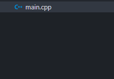

# 1. Resumo
Nesse capítulo, vou explicar o básico da estrutura de um projeto C++, além das primeiras coisas que um iniciante se depararia aprendendo a linguagem.

Você precisará de um editor de textos e um compilador C++ instalado e funcionando no seu computador. Há vários tutoriais pela internet ensinando isso caso você não tenha ainda, como o foco não é esse vou assumir que você já tem tudo que precisa. Pra esse capítulo e todos os seguintes vou estar usando o compilador G++ (MinGW) em um computador Windows 64 bits, e como editor de código estarei usando Visual Studio Code.

Tendo dito tudo isso, vamos começar.

# 2. Main
## O Básico
Todo projeto em C++ precisa de apenas uma coisa: um ponto de entrada. Por consistência e padrão, o arquivo principal de um projeto geralmente é chamado de **main.cpp**. A extensão **cpp** significa que o arquivo é um **código-fonte em C++**.

Todo executável em um sistema operacional precisa começar a executar o código de algum lugar, então o compilador do C++ sempre procura uma função chamada **main** pra ser o ponto de entrada do programa. Uma função é simplesmente um bloco de código que pode ser reusado e chamado de outros lugares. No caso de main exclusivamente, quem chama ela e executa é o sistema operacional.

Vou por partes nesse código: primeiro nós definimos a função main. O `int` ali no começo indica o **tipo de retorno da função**. int, abreviação para integer, significa **inteiro**. Em C/C++, na maioria dos sistemas modernos, int é um número com tamanho de 4 bytes. ou seja, int pode representar números na escala de 2 bilhões. Mais tarde vou explicar melhor tipos em C++, por enquanto apenas pense em tipo como um indicador pro compilador saber como usar aquele valor.

Depois de definir o tipo e dar um nome pra função, nós abrimos e fechamos parênteses: `()`. Dentro dos parênteses é possível passar valores especiais chamados de **argumentos**. Por enquanto nós não vamos precisar de nenhum argumento, então deixe o espaço dentro dos parênteses vazio. Feito tudo isso, você precisa abrir e fechar chaves pra indicar o **escopo** ou **bloco de código** da função. Tudo dentro das chaves é o código da função **main**, ou seja, se você colocar algum código depois do `}`. o compilador vai considerar aquele código como se não fizesse parte de main e não vai executar ele.

Dentro do bloco de main, eu coloquei `return 0;`. O que isso significa? Vamos por partes:

`return` é uma palavra-chave especial que surgiu em C e portada para C++. O que ela faz é bem simples: encerra a função e retorna o valor que vem logo após.

Lembra que main retorna `int`, um número inteiro? `return 0` está retornando para o sistema operacional (que chamou main) o número 0. O sistema operacional, por padrão, trata o valor retornado por main como um código de saída chamado de Exit Code. 0 é comumente tratado como o Exit Code que representa "sucesso". Ou seja, nada deu errado na execução do programa e ele fechou corretamente. Como nós não fizemos nada que pode dar errado ainda, só retornamos 0 pro sistema operacional saber que está tudo certo.

`;` é usado em C++ para indicar o fim de uma instrução, é como o ponto final na língua portuguesa. Em outras linguagens como Python o ponto e vírgula é opcional, mas **em C++ ele é obrigatório e o compilador vai apontar um erro se não encontrá-lo.**.

## Hora de algo mais interessante!
Por enquanto o nosso programa não faz nada além de retornar um código de saída indicando sucesso pro sistema operacional. É hora de adicionar um pouco de texto ao terminal!

Para enviar texto para o terminal em um sistema operacional, o C++ nos dá o objeto **cout**! O cout recebe um stream de saída (pense nisso puramente como um texto, ou uma mensagem), e então envia pro terminal do seu sistema operacional.

Mas antes, para poder usar o objeto `cout`, você precisa entender um conceito de C++ chamado `#include`. O #include é um comando especial que o compilador lê e faz uma ação especial. Ele é chamado de preprocessor (pré-processador), porque o compilador processa essas instruções de forma diferente do resto do seu código. Primeiro, vamos incluir `cout`, que se encontra na biblioteca `iostream` do C++.

Quando o compilador lê o preprocessor `#include`, ele vai procurar em uma pasta especial um arquivo de código chamado `iostream`, e então o compilador pega todo o código que tá dentro desse arquivo e substitui o seu #include por esse código. 

É dessa forma que C++ nos permite separar código entre vários lugares diferentes e usar todos em um lugar só. Efetivamente a gente só copia e cola código de outros lugares no nosso arquivo, mas é feito automaticamente pelo compilador.

🎊 **Pronto!** Agora nós podemos usar `cout` no nosso código. Mas como fazemos isso? Você precisa ter em mente apenas um detalhe: lá atrás, em C, não havia nenhuma forma de separar o nome de funções e variáveis no código. Ou seja, digamos que você tenha uma função chamada `festa`, que inicia uma festa no seu terminal. Mas, seu primo entrou no seu projeto e criou outra função chamada `festa`. Não havia forma de ter duas funções com o mesmo nome naquela época, então uma coisa que os programadores C faziam eram adicionar **prefixos** no começo das funções pra diferenciar elas:

Mas C++ não é tão rudimentar assim! Em C++, foi introduzida uma funcionalidade chamada `namespaces`, em que coisas podem ser agrupadas em namespaces diferentes pra ter o mesmo nome. Um exemplo disso usando nosso exemplo em C:

Agora usando namespaces, nós podemos separar as duas funções festa, e chamar as duas em main!

Sim, sim, namespaces são legais e tudo mais, mas por que eu expliquei tudo isso? Quando nós incluímos `iostream` no nosso código, tudo de iostream fica dentro de uma namespace chamada **std**, abreviação de standard. `std` é a namespace padrão de C++, onde tudo que vem por padrão na linguagem fica guardada, pra evitar conflito entre nomes. Como você deve ter notado na última imagem, para acessar algo dentro de uma namespace é utilizado o operador `::`. Ou seja, para acessar cout, tudo o que precisamos fazer é usar: `std::cout`.

Agora vamos para uma estranheza de C++: para usar o objeto `cout`, você precisa usar o operador `<<` e então passar o valor que você quer enviar pro terminal. No próximo capítulo vou explicar melhor os tipos e o que são operadores!

E não se esqueça de encerrar a instrução com um `;`:

"Olá, mundo" ou "Hello, world" é uma prática comum no mundo da programação como primeiro projeto na hora de aprender algo. (Eu escrevi sem acento porque C++ tem um problema com acentos)

# 3. Como executar?

Lembrando que vou assumir que você está usando o compilador G++.

Para compilar é bem simples, dentro do terminal no seu projeto, basta usar o comando: `g++ [nome do arquivo].cpp`. Como eu nomeei o meu arquivo como `main.cpp`, basta usar: `g++ main.cpp`.
Isso vai criar um arquivo chamado `a.exe` ao lado do main.cpp. Se eu executar esse executável, aparecerá no terminal o texto esperado!

Se você quiser mudar o nome do executável que o compilador vai criar, basta passar o nome depois de `-o`. Por exemplo: `g++ main.cpp -o main.exe`, vai compilar o main.cpp em um arquivo chamado main.exe!

# 4. Finalização

No próximo capítulo irei explicar melhor variáveis, tipos e operadores do C++!

[Capítulo 3 - Memória](c3-data.md)
